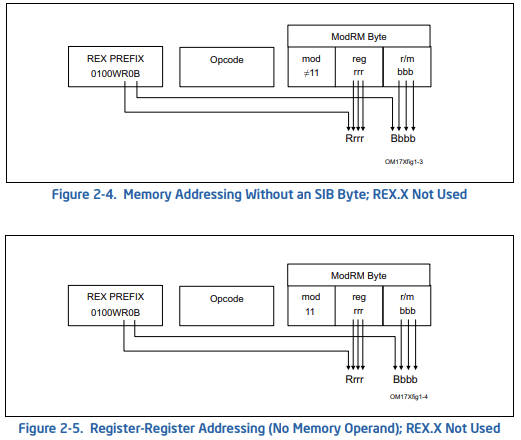
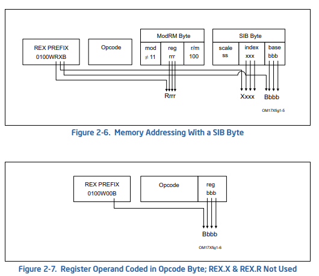
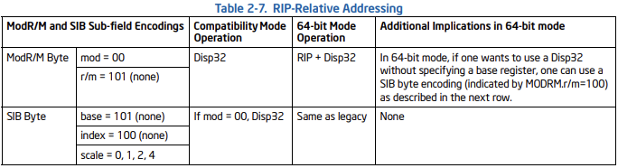

# 系统调用
WIndows平台下R3（用户态）切换到R0（内核态）系统调用 由一条CPU指令完成：syscall
系统调用主要分为3种形式：

-Int 2EH 
~~~~
1.从KernelBase!CreateFileW开始，函数内部调用call Ntdll!NtCreateFile。

2.来到Ntdll!NtCreateFile,按照惯例，把系统调用号保存到eax,以便之后根据系统调用号索引SSDT上对应的系统调用例程。

值得注意的是，在所有的体系结构中，都有一个称为KUSER_SHARED_DATA的结构体，它属于进程，并且总是映射到0x7ffe0000，

对应的SystemCall字段偏移是0x300(位置会根据不同平台而有所不同)。

KUSER_SHARED_DATA.SystemCall对应的值就是ntdll!KiInitSystemCall的地址。

3.进入KiIntSystemCall,内部调用int 2eh调用IDT上对应的中断处理例程。

其中，IDT上0x2e的项为nt!KiSystemService。

4.走进nt!KiSystemService。它就是系统调用分发函数。

内部就会根据系统调用号索引SSDT上对应的系统调用例程，实现相应的功能。最后返回用户领空。
~~~~

-x86的 sysenter  (sysenter/sysexit 一对配套指令用于快速在R3和R0之间转换的指令)

-x64的 syscall   (syscall/sysret 一对配套指令用于快速在R3和R0之间转换的指令)

## Syscall指令基本流程：

1> 把 SYSCALL 的下一条指令保存到 RCX 
2> 处理器会把 RFLAGS 保存到 R11 
3> 目标指令指针 — 从 IA32_LSTAR 读取 64 位的地址 
4> 状态标志 — 把 IA32_FMASK MSR 中的值按位取反后，与当前 RFLAGS 进行逻辑与得到 
5> IA32_STAR[47:32] MSR的值赋予CS段描述符并设置RPL特权请求级别为0 
6> 设置对应CS的段描述符

==============================================================
#### 伪码（来自Intel手册Vol. 2B 4-689）

~~~~
IF (CS.L ≠ 1 ) or (IA32_EFER.LMA ≠ 1) or (IA32_EFER.SCE ≠ 1)
(* Not in 64-Bit Mode or SYSCALL/SYSRET not enabled in IA32_EFER *)
THEN #UD;
FI;
RCX := RIP; (* Will contain address of next instruction *)
RIP := IA32_LSTAR;
R11 := RFLAGS;
RFLAGS := RFLAGS AND NOT(IA32_FMASK);
CS.Selector := IA32_STAR[47:32] AND FFFCH (* Operating system provides CS; RPL forced to 0 *)
(* Set rest of CS to a fixed value *)
CS.Base := 0; (* Flat segment *)
CS.Limit := FFFFFH; (* With 4-KByte granularity, implies a 4-GByte limit *)
CS.Type := 11; (* Execute/read code, accessed *)
CS.S := 1;
CS.DPL := 0;
CS.P := 1;
CS.L := 1; (* Entry is to 64-bit mode *)
CS.D := 0; (* Required if CS.L = 1 *)
CS.G := 1; (* 4-KByte granularity *)
~~~~

IA32_STAR（0xC0000081）：Ring 0和Ring 3段基址，以及SYSCALL的EIP。 
在较低的32位中存储的是SYSCALL的EIP，在第32-47位存储内核段基址，在第48-63为存储用户段基址。 
IA32_CSTAR（0xC0000083）：兼容模式下，SYSCALL的内核RIP相对寻址。 
IA32_LSTAR（0xC0000082）：长模式（Long Mode，即64位）下，SYSCALL的内核RIP相对寻址。

#### Windbg读取的 IA32_FMASK[C0000084H] MSR寄存器

~~~~
[来源Intel Vol. 4 2-61; Table 2-2. IA-32 Architectural MSRs (Contd.)]

kd> rdmsr C0000084H
msr[c0000084] = 00000000`00004700

kd> .formats 00000000`00004700
Evaluate expression:
  Hex:     00000000`00004700
  Decimal: 18176
  Decimal (unsigned) : 18176
  Octal:   0000000000000000043400
  Binary:  00000000 00000000 00000000 00000000 00000000 00000000 01000111 00000000
  Chars:   ......G.
  Time:    Thu Jan  1 13:02:56 1970
  Float:   low 2.547e-041 high 0
  Double:  8.98014e-320

取反后是 FFFFFFFF`FFFFB8FF,也就是对应[RFLAG寄存器]的TF、IF、DF、NT位设置为零

TF标志位:陷阱标志（Trap flag）是标志寄存器的第8位，当其被设置时将开启单步调试模式。在其被设置的情况下，每个指令被执行后都将产生一个调试异常，以便于观察指令执行后的情况。

IF标志位:中断标志（Interrupt flag）是标志寄存器的第9位，当其被设置时表示CPU可响应可屏蔽中断（maskable interrupt）。

DF标志位:IF标志位位于标志寄存器第9位，名称为方向标志位。

NT标志位:嵌套任务（Nested task flag）是标志寄存器的第14位，用于控制中断返回指令IRET的执行方式。
若被设置则将通过中断的方式执行返回，否则通过常规的堆栈的方式执行。在执行CALL指令、中断或异常处理时，处理器将会设置该标志。
~~~~

#### Sysret
此指令用于从内核态返回用户态，过程可反向参考syscall，执行此指令后CPU回到用户特权级(R3)并执行用户层代码。

~~~~
[伪码Intel Vol. 2B 4-699]
IF (CS.L ≠ 1 ) or (IA32_EFER.LMA ≠ 1) or (IA32_EFER.SCE ≠ 1)
(* Not in 64-Bit Mode or SYSCALL/SYSRET not enabled in IA32_EFER *)
THEN #UD; FI;
IF (CPL ≠ 0) THEN #GP(0); FI;
IF (operand size is 64-bit) 
THEN (* Return to 64-Bit Mode *)
IF (RCX is not canonical) THEN #GP(0);
RIP := RCX;
ELSE (* Return to Compatibility Mode *)
RIP := ECX;
FI;
RFLAGS := (R11 & 3C7FD7H) | 2; (* Clear RF, VM, reserved bits; set bit 1 *)

合法性检测
rip = ecx/ecx
根据R11的值对RFLAGS赋值，且RF,VM，部分reserved位复位。
CS.Selector = IA32_STAR[63:48] + 16/IA32_STAR[63:48]
修正CS,SS,CPL
~~~~

==============================================================

## 内核接管流程

R3调用syscall后在内核执行的函数 KiSystemCall64 (开启页表隔离KPTI后是KiSystemCall64Shadow)

基本流程： 
1->切换GS指向KPCR(CPU控制区 Processor Control Region) 
2->用户栈切换到内核栈 
3->STAC指令将SMAP关闭(STAC指令相当于Set AC 用于设置AC标志位，能暂时解除系统的一些保护，包括SMAP保护) 
4->保存用户线程Context到_KTRAP_FRAME 
5->根据EAX内容算出用户指定的内核态例程地址 
6->将用户栈上的参数复制到内核栈 
7->调用内核函数 
8->执行用户态APC 
9->将函数返回值写入_KTRAP_FRAME.RAX,恢复用户态Context,使用Sysret指令返回用户态执行

### 相关要点补充

AC位影响SMAP相关描述

<pre><code>
==============================================================

#### Intel(Vol. 3A 4-34)
~~~~
— Data reads from user-mode pages.
Access rights depend on the value of CR4. SMAP:
• If CR4. SMAP = 0, data may be read from any user-mode address with a protection key for which read access is permitted.
• If CR4. SMAP = 1, access rights depend on the value of EFLAGS. AC and whether the access is implicit or
explicit:
— If EFLAGS. AC = 1 and the access is explicit, data may be read from any user-mode address with a protection key for which read access is permitted.
— If EFLAGS. AC = 0 or the access is implicit, data may not be read from any user-mode address
~~~~

大致意思:

—如果是EFLAGS.AC = 1并且访问是显式的，数据可以从任何具有允许读访问的保护键的用户模式地址读取。

—如果是EFLAGS.AC = 0或访问是隐式的，则不能从任何用户模式地址读取数据

==============================================================
</code></pre>

FS/GS寄存器

<pre><code>
==============================================================

3环FS/GS指向_TEB 
0环FS/GS指向_KPCR

在64位系统下
gs:[0x30] 指向TEB
gs:[0x60] 指向PEB

==============================================================
</code></pre>

_KPCR结构解析

<pre><code>
==============================================================

~~~~
//0x178 bytes (sizeof)
struct _KPCR
{
    union
    {
        struct _NT_TIB NtTib;                                               //0x0   保存CPU常用的信息(比如异常处理函数链表、栈大小空间限制)
        struct
        {
            union _KGDTENTRY64* GdtBase;                                    //0x0
            struct _KTSS64* TssBase;                                        //0x8
            ULONGLONG UserRsp;                                              //0x10  指向自身,类似C++的this指针一样，方便编程
            struct _KPCR* Self;                                             //0x18
            struct _KPRCB* CurrentPrcb;                                     //0x20  指向 PrcbData : _KPRCB 结构体，该结构体为_KPCR的拓展，这么做(而不是使用偏移)是为了当其地址改变时也能正确找到
            struct _KSPIN_LOCK_QUEUE* LockArray;                            //0x28
            VOID* Used_Self;                                                //0x30
        };
    };
    union _KIDTENTRY64* IdtBase;                                            //0x38  IDT表 一个CPU一套
    ULONGLONG Unused[2];                                                    //0x40
    UCHAR Irql;                                                             //0x50  IRQL中断等级
    UCHAR SecondLevelCacheAssociativity;                                    //0x51
    UCHAR ObsoleteNumber;                                                   //0x52  当前CPU编号
    UCHAR Fill0;                                                            //0x53
    ULONG Unused0[3];                                                       //0x54
    USHORT MajorVersion;                                                    //0x60  版本细节
    USHORT MinorVersion;                                                    //0x62  版本细节
    ULONG StallScaleFactor;                                                 //0x64
    VOID* Unused1[3];                                                       //0x68
    ULONG KernelReserved[15];                                               //0x80
    ULONG SecondLevelCacheSize;                                             //0xbc
    ULONG HalReserved[16];                                                  //0xc0
    ULONG Unused2;                                                          //0x100
    VOID* KdVersionBlock;                                                   //0x108 仅在0号CPU下有值
    VOID* Unused3;                                                          //0x110
    ULONG PcrAlign1[24];                                                    //0x118
}; 

//0x38 bytes (sizeof)
struct _NT_TIB
{
    struct _EXCEPTION_REGISTRATION_RECORD* ExceptionList;                   //0x0   异常链表
    VOID* StackBase;                                                        //0x8   栈基址
    VOID* StackLimit;                                                       //0x10  栈大小显示
    VOID* SubSystemTib;                                                     //0x18
    union
    {
        VOID* FiberData;                                                    //0x20
        ULONG Version;                                                      //0x20
    };
    VOID* ArbitraryUserPointer;                                             //0x28
    struct _NT_TIB* Self;                                                   //0x30  this指针指向结构体自己
}; 

~~~~

==============================================================
</code></pre>

_KPRCB结构解析

<pre><code>
==============================================================
起始一般位于_KPCR表结尾,属于_KPCR的拓展表

~~~~
//0x700 bytes (sizeof)
struct _KPRCB
{
    ULONG MxCsr;                                                            //0x0
    UCHAR LegacyNumber;                                                     //0x4
    UCHAR ReservedMustBeZero;                                               //0x5
    UCHAR InterruptRequest;                                                 //0x6
    UCHAR IdleHalt;                                                         //0x7
    struct _KTHREAD* CurrentThread;                                         //0x8   当前运行线程
    struct _KTHREAD* NextThread;                                            //0x10  下一个要切换的线程
    struct _KTHREAD* IdleThread;                                            //0x18  系统空闲进程
    UCHAR NestingLevel;                                                     //0x20
    UCHAR ClockOwner;                                                       //0x21
    union
    {
        UCHAR PendingTickFlags;                                             //0x22
        struct
        {
            UCHAR PendingTick:1;                                            //0x22
            UCHAR PendingBackupTick:1;                                      //0x22
        };
    };
    UCHAR IdleState;                                                        //0x23
    ULONG Number;                                                           //0x24
    ULONGLONG RspBase;                                                      //0x28
    ULONGLONG PrcbLock;                                                     //0x30
    CHAR* PriorityState;                                                    //0x38
    CHAR CpuType;                                                           //0x40
    CHAR CpuID;                                                             //0x41
    union
    {
        USHORT CpuStep;                                                     //0x42
        struct
        {
            UCHAR CpuStepping;                                              //0x42
            UCHAR CpuModel;                                                 //0x43
        };
    };
    ULONG MHz;                                                              //0x44
    ULONGLONG HalReserved[8];                                               //0x48
    USHORT MinorVersion;                                                    //0x88
    USHORT MajorVersion;                                                    //0x8a
    UCHAR BuildType;                                                        //0x8c
    UCHAR CpuVendor;                                                        //0x8d
    UCHAR LegacyCoresPerPhysicalProcessor;                                  //0x8e
    UCHAR LegacyLogicalProcessorsPerCore;                                   //0x8f
    ULONGLONG TscFrequency;                                                 //0x90
    ULONG CoresPerPhysicalProcessor;                                        //0x98
    ULONG LogicalProcessorsPerCore;                                         //0x9c
    ULONGLONG PrcbPad04[4];                                                 //0xa0
    struct _KNODE* ParentNode;                                              //0xc0
    ULONGLONG GroupSetMember;                                               //0xc8
    UCHAR Group;                                                            //0xd0
    UCHAR GroupIndex;                                                       //0xd1
    UCHAR PrcbPad05[2];                                                     //0xd2
    ULONG InitialApicId;                                                    //0xd4
    ULONG ScbOffset;                                                        //0xd8
    ULONG ApicMask;                                                         //0xdc
    VOID* AcpiReserved;                                                     //0xe0
    ULONG CFlushSize;                                                       //0xe8
    ULONGLONG PrcbPad11[2];                                                 //0xf0
    struct _KPROCESSOR_STATE ProcessorState;                                //0x100
    struct _XSAVE_AREA_HEADER* ExtendedSupervisorState;                     //0x6c0
    ULONG ProcessorSignature;                                               //0x6c8
    ULONG ProcessorFlags;                                                   //0x6cc
    ULONGLONG PrcbPad12a;                                                   //0x6d0
    ULONGLONG PrcbPad12[3];                                                 //0x6d8
}; 
~~~~
==============================================================
</code></pre>

RIP相对寻址(Rip_Relative_Addressing)

==============================================================

#### 原文介绍(RIP-Relative Addressing For Intel Vol. 2A 2-12)

>Figure 2-3. Prefix Ordering in 64-bit Mode 汇编指令构成

|Legacy Prefixes|REX Prefix|Opcode|ModR/M|SIB|Displacement|Immediate|
|:----:|:----:|:----:|:----:|:----:|:----:|:----:|
|Grp 1, Grp 2 Grp 3, Grp 4 (optional)|(optional)|1-,2-, or 3-byte opcode|1 byte (if required)|1 byte (if required)|Addres displacement of 1, 2, or 4 bytes|Immediate data of 1, 2, or 4 bytes or none|
---
>Table 2-4. REX Prefix Fields [BITS: 0100WRXB]

|Field Name|Bit Position|Definition|
|:-:|:-:|:-|
|-|7:4|0100|
|W|3|0 = Operand size determined by CS.D 1 = 64 Bit Operand Size|
|R|2|Extension of the ModR/M reg field|
|X|1|Extension of the SIB index field|
|B|0|Extension of the ModR/M r/m field, SIB base field, or Opcode reg field|
---

 

---
>Table 2-7. RIP-Relative Addressing

<pre><code>
~~~~
[2.2.1.5 Immediates] 
In 64-bit mode, the instruction’s default operation size is 32 bits. Use of the REX.R prefix permits access to additional
registers (R8-R15). Use of the REX.W prefix promotes operation to 64 bits. See the summary chart at the
beginning of this section for encoding data and limits.

在64位下仍使用32位操作数，REX.R扩展寄存器，REX.W扩展指令。 RIP是64位的新特性，在64位下，指令使用特定的Mod\rm来使用RIP，RIP的偏移是32位故寻址范围为上下2GB。 RIP的计算时相对于当前指令的下一条指令的地址来计算的，既目标地址=下一条指令地址+偏移。 RIP中ModR\M不取决于指令前缀，比如指令前缀与R\M指定了R13寄存器，但mod是00，指令仍然使用RIP而不是r13寄存器。

~~~~
</code></pre>

> .text:000000014040F274 4C 8D 15 45 26 9F 00          lea     r10, KeServiceDescriptorTable   ; 非GUI线程使用 SSDT Offset 
> .text:000000014040F27B 4C 8D 1D BE D7 8E 00          lea     r11, KeServiceDescriptorTableShadow ; GUI线程使用 SSDTShadow 
>
>以原始指令[4C 8D 15 45 26 9F 00]为例： 
>[4C]是REX Prefix二进制是[0100 1100] 
>[8D]是Opcode 也就是lea指令 
>[15]是ModR/M二进制是[0001 0101] 
>[45 26 9F 00]为Offset，也就是[00 9F 26 45]
>
>REX Prefix的第2位和ModR/M[5:3]的reg联合指定寄存器即[1 010]也就是R10寄存器,SIB不使用则默认使用RIP 
>目标绝对地址=RIP[下一条要执行的指令的64位地址]+Offset[00 9F 26 45]

==============================================================

SSDT系统服务描述符表

<pre><code>
==============================================================

~~~~
SSDT 对应 ntoskrnl.exe 中的服务函数，这些函数实现了如文件管理、进程管理、设备管理等等相关的功能。
ShadowSSDT 对应 win32k.sys 中的服务函数，重点实现创建窗口、查找窗口、窗口绘图等 Gdi 与用户交互相关的功能。

Win7 32 位系统中，SSDT 在内核 Ntoskrnl.exe 中导出，直接获取导出符号 KeServiceDescriptorTable。
而在 64 位系统中，SSDT 表并没有在内核 Ntoskrnl.exe 中导出，我们不能像 32 位系统中那样直接获取导出符号 KeServiceDescriptorTable。
Win7 x64 与 Win10 64（Win10低版本）中 通过 __readmsr(0xC0000082) 获取内核函数 KiSystemCall64 的地址
KiSystemCall64 中调用了 KeServiceDescriptorTable 和 KeServiceDescriptorTableShadow

win10 高版本中 __readmsr(0xC0000082) 返回 KiSystemCall64Shadow 函数,代码从 win32k!NtXXX 跳转到了 win32kfull!NtXXX。
win32k.sys 不再直接处理来自用户层的系统服务调用，而真正去处理用户的系统服务调用的函数，实际上是 win32kfull.sys 中的同名函数
~~~~

==============================================================
</code></pre>

#### IDA源码(KiSystemCall64)
~~~~
.text:000000014040EF00 swapgs                                  ; 切换GS使GS：0指向_KPCR
.text:000000014040EF03 mov     gs:_KPCR.___u0.__s1.UserRsp, rsp
.text:000000014040EF0C mov     rsp, gs:_KPCR.Prcb.RspBase      ; 切换到内核态
.text:000000014040EF15 push    2Bh ; '+'                       ; 内核栈上构造Trap_Frame 大小是0x190 rsp指向栈顶0x190位置
.text:000000014040EF15                                         ; 该指令等于rsp+0x8 从_KTRAP_FRAME.SegSs+0x188开始压栈
.text:000000014040EF17 push    gs:_KPCR.___u0.__s1.UserRsp
.text:000000014040EF1F push    r11                             ; _KTRAP_FRAME.EFlags=R11 =RFLAGS (syscall)
.text:000000014040EF21 push    33h ; '3'                       ;     USHORT SegCs;                                                           //0x170
.text:000000014040EF21                                         ;     UCHAR Fill0;                                                            //0x172
.text:000000014040EF21                                         ;     UCHAR Logging;                                                          //0x173
.text:000000014040EF21                                         ;     USHORT Fill1[2];                                                        //0x174
.text:000000014040EF23 push    rcx                             ; _KTRAP_FRAME.Rip=RCX=UserRip(syscall)
.text:000000014040EF24 mov     rcx, r10                        ; R10=Rcx (Ntdll.dll)
.text:000000014040EF27 sub     rsp, 8                          ; skip ExceptionFram and ErrorCode
.text:000000014040EF2B push    rbp                             ; 保存 userRBP 到 _KTRAP_FRAME.Rbp(+0x158)
.text:000000014040EF2C sub     rsp, 158h                       ; 提升栈顶指针到_KTRAP_FRAME顶部
.text:000000014040EF33 lea     rbp, [rsp+_KTRAP_FRAME._Xmm1.Low] ; RBP->_KTRAP_FRAME.Xmm1(0x80)
.text:000000014040EF3B mov     [rbp+0C0h], rbx                 ; _KTRAP_FRAME.Rbx
.text:000000014040EF42 mov     [rbp+0C8h], rdi                 ; _KTRAP_FRAME.Rdi
.text:000000014040EF49 mov     [rbp+0D0h], rsi                 ; _KTRAP_FRAME.Rsi
.text:000000014040EF50 test    byte ptr cs:KeSmapEnabled, 0FFh ; KeSmapEnabled标志位，是否开启Smap该位的作用是阻止处于内核权限的CPU读取或写入用户代码
.text:000000014040EF57 jz      short loc_14040EF65             ; _KTRAP_FRAME.Rax
.text:000000014040EF57
.text:000000014040EF59 test    byte ptr [rbp+0F0h], 1          ; 判断执行syscall前的特权模式
.text:000000014040EF60 jz      short loc_14040EF65             ; 若为内核态则不必关闭SMAP保护 SMAP(Supervisor Mode Access Prevention，管理模式访问保护)和SMEP(Supervisor Mode Execution Prevention，管理模式执行保护)
.text:000000014040EF60
.text:000000014040EF62 stac                                    ; Set AC Flag 允许在SMAP激活的情况下，在内核态访问用户态数据

.text:000000014040EF65 loc_14040EF65:                          ; CODE XREF: KiSystemCall64+57↑j
.text:000000014040EF65                                         ; KiSystemCall64+60↑j
.text:000000014040EF65 mov     [rbp-50h], rax                  ; _KTRAP_FRAME.Rax
.text:000000014040EF69 mov     [rbp-48h], rcx                  ; _KTRAP_FRAME.Rcx
.text:000000014040EF6D mov     [rbp-40h], rdx                  ; _KTRAP_FRAME.Rdx
.text:000000014040EF71 mov     rcx, gs:_KPCR.Prcb.CurrentThread
.text:000000014040EF7A mov     rcx, [rcx+_KTHREAD.Process]
.text:000000014040EF81 mov     rcx, [rcx+_EPROCESS.SecurityDomain]
.text:000000014040EF88 mov     gs:_KPCR.Prcb.___u42.PrcbPad11, rcx
.text:000000014040EF91 mov     cl, byte ptr gs:_KPCR.Prcb.___u47.PrcbPad12a
.text:000000014040EF99 mov     byte ptr gs:_KPCR.Prcb.___u47.PrcbPad12a+1, cl
.text:000000014040EFA1 mov     cl, byte ptr gs:_KPCR.Prcb.___u42.PrcbPad11+8
.text:000000014040EFA9 mov     byte ptr gs:_KPCR.Prcb.___u47.PrcbPad12a+2, cl
.text:000000014040EFB1 movzx   eax, byte ptr gs:_KPCR.Prcb.___u42.PrcbPad11+0Bh
.text:000000014040EFBA cmp     byte ptr gs:_KPCR.Prcb.___u42.PrcbPad11+0Ah, al
.text:000000014040EFC2 jz      short loc_14040EFD5
.text:000000014040EFC2
.text:000000014040EFC4 mov     byte ptr gs:_KPCR.Prcb.___u42.PrcbPad11+0Ah, al
.text:000000014040EFCC mov     ecx, 48h ; 'H'                  ; IA32_SPEC_CTRL MSR分支预测相关
.text:000000014040EFD1 xor     edx, edx
.text:000000014040EFD3 wrmsr                                   ; MSR[ECX]=EDX:EAX 写模式定义寄存器。
.text:000000014040EFD3                                         ; 对于WRMSR指令，把要写入的信息存入(EDX：EAX)中
.text:000000014040EFD3                                         ; 执行写指令后，即可将相应的信息存入ECX指定的MSR中
.text:000000014040EFD3
.text:000000014040EFD5
.text:000000014040EFD5 loc_14040EFD5:                          ; CODE XREF: KiSystemCall64+C2↑j
.text:000000014040EFD5 movzx   edx, byte ptr gs:_KPCR.Prcb.___u42.PrcbPad11+8
.text:000000014040EFDE test    edx, 8
.text:000000014040EFE4 jz      short loc_14040EFFD             ; 若CPU存在可以干预分支预测的功能
.text:000000014040EFE4                                         ; 则不必使用浪费性能的软件补丁解决漏洞
.text:000000014040EFE4
.text:000000014040EFE6 mov     eax, 1
.text:000000014040EFEB xor     edx, edx
.text:000000014040EFED mov     ecx, 49h ; 'I'                  ; IA32_PRED_CMD MSR
.text:000000014040EFF2 wrmsr                                   ; MSR[ECX]=EDX:EAX
.text:000000014040EFF4 movzx   edx, byte ptr gs:_KPCR.Prcb.___u42.PrcbPad11+8

......分支预测相关的东西

.text:000000014040F12E loc_14040F12E:                          ; CODE XREF: KiSystemCall64+103↑j
.text:000000014040F12E lfence                                  ; 禁止CPU对后面的指令预测执行
.text:000000014040F131 mov     byte ptr gs:_KPCR.Prcb.___u47.PrcbPad12a+3, 0
.text:000000014040F131
.text:000000014040F13A
.text:000000014040F13A KiSystemServiceUser:                    ; CODE XREF: KiSystemService+231↑j
.text:000000014040F13A                                         ; KiSystemCall64Shadow+252↓j
.text:000000014040F13A mov     [rbp+(_KTRAP_FRAME.ExceptionActive-80h)], 2 ; _KTRAP_FRAME.ExceptionActive
.text:000000014040F13E mov     rbx, gs:_KPCR.Prcb.CurrentThread
.text:000000014040F147 prefetchw byte ptr [rbx+_KTHREAD.TrapFrame] ; 预写时将数据预取到缓存中
.text:000000014040F14E stmxcsr dword ptr [rbp-54h]             ; _KTRAP_FRAME.MxCsr STMXCSR指令将MXCSR寄存器状态保存到存储器中
.text:000000014040F152 ldmxcsr dword ptr gs:180h               ; LDMXCSR指令从存储器中加载到MXCSR寄存器
.text:000000014040F15B cmp     [rbx+_KTHREAD.Header.___u0.__s2.Reserved1], 0
.text:000000014040F15F mov     word ptr [rbp+80h], 0           ; _KTRAP_FRAME.ExceptionFrame
.text:000000014040F168 jz      loc_14040F23E                   ; _KTRAP_FRAME.RAX Trap_Frame取出用户态数据

.......

.text:000000014040F242 mov     rcx, [rbp-48h]                  ; _KTRAP_FRAME.RCX
.text:000000014040F246 mov     rdx, [rbp-40h]                  ; _KTRAP_FRAME.RDX
.text:000000014040F24A sti                                     ; 启用中断响应 syscall执行时候中断被关闭
.text:000000014040F24A                                         ; CLI禁止中断发生
.text:000000014040F24A                                         ; STI允许中断发生
.text:000000014040F24B mov     [rbx+_KTHREAD.FirstArgument], rcx
.text:000000014040F252 mov     [rbx+_KTHREAD.SystemCallNumber], eax
.text:000000014040F258 nop     dword ptr [rax+rax+00000000h]
.text:000000014040F258
.text:000000014040F260
.text:000000014040F260 KiSystemServiceStart:                   ; DATA XREF: KiServiceInternal+5A↑o
.text:000000014040F260                                         ; .data:0000000140C00340↓o
.text:000000014040F260 mov     [rbx+_KTHREAD.TrapFrame], rsp
.text:000000014040F267 mov     edi, eax                        ; 需要调用的函数号
.text:000000014040F269 shr     edi, 7                          ; 右移7位
.text:000000014040F26C and     edi, 20h                        ; 取EAX[12] 函数地址表(ServiceOffsetTable)索引
.text:000000014040F26F and     eax, 0FFFh                      ; 取EAX[11:0] 函数表索引
.text:000000014040F26F
.text:000000014040F274
.text:000000014040F274 KiSystemServiceRepeat:                  ; CODE XREF: KiSystemCall64+B7A↓j
.text:000000014040F274 lea     r10, KeServiceDescriptorTable   ; 非GUI线程使用 SSDT Offset
.text:000000014040F27B lea     r11, KeServiceDescriptorTableShadow ; GUI线程使用 SSDTShadow Offset
.text:000000014040F282 test    [rbx+_KTHREAD.ThreadFlags], 80h ; 获取ThreadFlags[7]的GuiThread位判断是否是Gui线程
.text:000000014040F289 jz      short NotGuiThread
.text:000000014040F289
.text:000000014040F28B test    [rbx+_KTHREAD.ThreadFlags], 200000h ; ThreadFlags[21]的RestrictedGuiThread位 判断是否为受限制的GUI线程
.text:000000014040F292 jz      short GuiThread
.text:000000014040F292
.text:000000014040F294 lea     r11, KeServiceDescriptorTableFilter ; 受限的GUI线程使用
.text:000000014040F294
.text:000000014040F29B
.text:000000014040F29B GuiThread:                              ; CODE XREF: KiSystemCall64+392↑j
.text:000000014040F29B mov     r10, r11
.text:000000014040F29B
.text:000000014040F29E
.text:000000014040F29E NotGuiThread:                           ; CODE XREF: KiSystemCall64+389↑j
.text:000000014040F29E cmp     eax, [r10+rdi+10h]              ; 函数索引是否小于SSDT表的表项数量
.text:000000014040F2A3 jnb     IndexAboveTableSize
.text:000000014040F2A3
.text:000000014040F2A9 mov     r10, [r10+rdi]                  ; 获取SSDT表基址
.text:000000014040F2AD movsxd  r11, dword ptr [r10+rax*4]      ; 取得SSDT表中相对应编号函数的Offset 每个项大小为DD
.text:000000014040F2B1 mov     rax, r11                        ; 计算用Offset函数位置
.text:000000014040F2B4 sar     r11, 4                          ; x>>n == x / 2^n 去除偏移当中的参数
.text:000000014040F2B8 add     r10, r11                        ; 函数位置=SSDTBase+Offset
.text:000000014040F2BB cmp     edi, 20h ; ' '                  ; 是否是GUI函数
.text:000000014040F2BE jnz     short loc_14040F310

......
超出索引范围处理
.text:000000014040FA41 IndexAboveTableSize:                    ; CODE XREF: KiSystemCall64+3A3↑j
.text:000000014040FA41 cmp     edi, 20h ; ' '                  ; 是否调用GUI函数
.text:000000014040FA44 jnz     short Error_Exit                ; 超过SSDT表范围的退出
......

.text:000000014040F310 Non_GuiExecuteFun:                      ; CODE XREF: KiSystemCall64+3BE↑j
.text:000000014040F310                                         ; KiSystemCall64+3CF↑j
.text:000000014040F310 and     eax, 0Fh                        ; 取出参数位[3:0]
.text:000000014040F313 jz      KiSystemServiceCopyEnd          ; 没有参数位则跳转
.text:000000014040F313
.text:000000014040F319 shl     eax, 3                          ; 逻辑左移指令 a << b = a * (2^b)
.text:000000014040F31C lea     rsp, [rsp-70h]                  ; 分配新的栈空间用来存放从用户栈复制来的参数
.text:000000014040F321 lea     rdi, [rsp+100h+var_E8]
.text:000000014040F326 mov     rsi, [rbp+(_KTRAP_FRAME._Rsp-80h)] ; 用户态栈顶指针
.text:000000014040F32D lea     rsi, [rsi+20h]                  ; 忽略寄存器参数预留的栈空间(rsi+0x20)
.text:000000014040F331 test    byte ptr [rbp+(_KTRAP_FRAME.SegCs-80h)], 1 ; BYTE SegCs[0] == 1 ?
.text:000000014040F331                                         ; 根据SysCall前是否为用户模式
.text:000000014040F331                                         ; 决定是否探测用户地址空间可用性
.text:000000014040F338 jz      short loc_14040F350
.text:000000014040F338
.text:000000014040F33A cmp     rsi, cs:MmUserProbeAddress
.text:000000014040F341 cmovnb  rsi, cs:MmUserProbeAddress
.text:000000014040F349 nop     dword ptr [rax+00000000h]
.text:000000014040F349
.text:000000014040F350
.text:000000014040F350 loc_14040F350:                          ; CODE XREF: KiSystemCall64+438↑j
.text:000000014040F350 lea     r11, KiSystemServiceCopyEnd     ; 复制函数结束地址
.text:000000014040F357 sub     r11, rax                        ; 根据参数算出从函数的何处开始执行
.text:000000014040F35A jmp     r11                             ; 跳转到函数执行
.text:000000014040F35A
.text:000000014040F35A ; ---------------------------------------------------------------------------
.text:000000014040F35D align 20h
.text:000000014040F360
.text:000000014040F360 KiSystemServiceCopyStart:               ; DATA XREF: KiSystemServiceHandler+1A↑o
.text:000000014040F360 mov     rax, [rsi+70h]                  ; 执行复制 每8字节复制需要两个指令
.text:000000014040F364 mov     [rdi+70h], rax                  ; 用rax做中转从rsi取出存入rdi
.text:000000014040F368 mov     rax, [rsi+68h]
.text:000000014040F36C mov     [rdi+68h], rax
.text:000000014040F370 mov     rax, [rsi+60h]
.text:000000014040F374 mov     [rdi+60h], rax
.text:000000014040F378 mov     rax, [rsi+58h]
.text:000000014040F37C mov     [rdi+58h], rax
.text:000000014040F380 mov     rax, [rsi+50h]
.text:000000014040F384 mov     [rdi+50h], rax
.text:000000014040F388 mov     rax, [rsi+48h]
.text:000000014040F38C mov     [rdi+48h], rax
.text:000000014040F390 mov     rax, [rsi+40h]
.text:000000014040F394 mov     [rdi+40h], rax
.text:000000014040F398 mov     rax, [rsi+38h]
.text:000000014040F39C mov     [rdi+38h], rax
.text:000000014040F3A0 mov     rax, [rsi+30h]
.text:000000014040F3A4 mov     [rdi+30h], rax
.text:000000014040F3A8 mov     rax, [rsi+28h]
.text:000000014040F3AC mov     [rdi+28h], rax
.text:000000014040F3B0 mov     rax, [rsi+20h]
.text:000000014040F3B4 mov     [rdi+20h], rax
.text:000000014040F3B8 mov     rax, [rsi+18h]
.text:000000014040F3BC mov     [rdi+18h], rax
.text:000000014040F3C0 mov     rax, [rsi+10h]
.text:000000014040F3C4 mov     [rdi+10h], rax
.text:000000014040F3C8 mov     rax, [rsi+8]
.text:000000014040F3CC mov     [rdi+8], rax
.text:000000014040F3CC
.text:000000014040F3D0
.text:000000014040F3D0 KiSystemServiceCopyEnd:                 ; CODE XREF: KiSystemCall64+413↑j
.text:000000014040F3D0                                         ; DATA XREF: KiSystemServiceHandler+27↑o
.text:000000014040F3D0                                         ; KiSystemCall64:loc_14040F350↑o
.text:000000014040F3D0 test    cs:KiDynamicTraceMask, 1
.text:000000014040F3DA jnz     loc_14040FADF
.text:000000014040F3E0 test    dword ptr cs:PerfGlobalGroupMask+8, 40h
.text:000000014040F3EA jnz     loc_14040FB53
......

.text:000000014040FB53                               loc_14040FB53:                          ; CODE XREF: KiSystemCall64+4EA↑j
.text:000000014040FB53 48 83 EC 50                   sub     rsp, 50h
.text:000000014040FB57 48 89 4C 24 20                mov     [rsp+20h], rcx
.text:000000014040FB5C 48 89 54 24 28                mov     [rsp+28h], rdx
.text:000000014040FB61 4C 89 44 24 30                mov     [rsp+30h], r8
.text:000000014040FB66 4C 89 4C 24 38                mov     [rsp+38h], r9
.text:000000014040FB6B 4C 89 54 24 40                mov     [rsp+40h], r10
.text:000000014040FB70 49 8B CA                      mov     rcx, r10
.text:000000014040FB73 E8 08 8C 19 00                call    PerfInfoLogSysCallEntry         ; 日志记录开始
.text:000000014040FB73
.text:000000014040FB78 48 8B 4C 24 20                mov     rcx, [rsp+20h]
.text:000000014040FB7D 48 8B 54 24 28                mov     rdx, [rsp+28h]
.text:000000014040FB82 4C 8B 44 24 30                mov     r8, [rsp+30h]
.text:000000014040FB87 4C 8B 4C 24 38                mov     r9, [rsp+38h]
.text:000000014040FB8C 4C 8B 54 24 40                mov     r10, [rsp+40h]
.text:000000014040FB91 48 83 C4 50                   add     rsp, 50h
.text:000000014040FB95 49 8B C2                      mov     rax, r10
.text:000000014040FB98 FF D0                         call    rax                             ; 调用系统例程
.text:000000014040FB98
.text:000000014040FB9A 0F 1F 00                      nop     dword ptr [rax]
.text:000000014040FB9D 48 8B C8                      mov     rcx, rax
.text:000000014040FBA0 E8 7B 8C 19 00                call    PerfInfoLogSysCallExit          ; 记录日志结束
.text:000000014040FBA0
.text:000000014040FBA5 E9 4E F8 FF FF                jmp     loc_14040F3F8

......

.text:000000014040F456 mov     [rbp-50h], rax
.text:000000014040F45A xor     eax, eax
.text:000000014040F45C mov     [rbp-48h], rax
.text:000000014040F460 mov     [rbp-40h], rax
.text:000000014040F464 mov     [rbp-38h], rax
.text:000000014040F468 mov     [rbp-30h], rax
.text:000000014040F46C mov     [rbp-28h], rax
.text:000000014040F470 mov     [rbp-20h], rax
.text:000000014040F474 pxor    xmm0, xmm0
.text:000000014040F478 movaps  xmmword ptr [rbp-10h], xmm0
.text:000000014040F47C movaps  xmmword ptr [rbp+0], xmm0
.text:000000014040F480 movaps  xmmword ptr [rbp+10h], xmm0
.text:000000014040F484 movaps  xmmword ptr [rbp+20h], xmm0
.text:000000014040F488 movaps  xmmword ptr [rbp+30h], xmm0
.text:000000014040F48C movaps  xmmword ptr [rbp+40h], xmm0
.text:000000014040F490 mov     ecx, 1
.text:000000014040F495 mov     cr8, rcx
.text:000000014040F499 sti
.text:000000014040F49A call    KiInitiateUserApc
.text:000000014040F49A
.text:000000014040F49F cli
.text:000000014040F4A0 mov     ecx, 0
.text:000000014040F4A5 mov     cr8, rcx
.text:000000014040F4A9 mov     rax, [rbp-50h]
.text:000000014040F4AD jmp     short loc_14040F444
.text:000000014040F4AD
.text:000000014040F4AF ; ---------------------------------------------------------------------------
.text:000000014040F4AF
.text:000000014040F4AF loc_14040F4AF:                          ; CODE XREF: KiSystemCall64+554↑j
.text:000000014040F4AF test    byte ptr gs:27Eh, 2
.text:000000014040F4B8 jz      short loc_14040F4C9
.text:000000014040F4B8
.text:000000014040F4BA mov     [rbp-50h], rax                  ; 更改_KTRAP_FRAME.Rax使用户态取得R0函数的返回值
.text:000000014040F4BE xor     ecx, ecx
.text:000000014040F4C0 call    KiUpdateStibpPairing
.text:000000014040F4C0
.text:000000014040F4C5 mov     rax, [rbp-50h]
......

.text:000000014040F72B loc_14040F72B:                          ; CODE XREF: KiSystemCall64+700↑j
.text:000000014040F72B mov     rax, [rbp-50h]                  ; 设置返回值
.text:000000014040F72F mov     r8, [rbp+100h]                  ; _KTRAP_FRAME.RSP
.text:000000014040F736 mov     r9, [rbp+0D8h]                  ; _KTRAP_FRAME.RBP
.text:000000014040F73D xor     edx, edx
.text:000000014040F73F pxor    xmm0, xmm0
.text:000000014040F743 pxor    xmm1, xmm1
.text:000000014040F747 pxor    xmm2, xmm2
.text:000000014040F74B pxor    xmm3, xmm3
.text:000000014040F74F pxor    xmm4, xmm4
.text:000000014040F753 pxor    xmm5, xmm5
.text:000000014040F757 mov     rcx, [rbp+0E8h]                 ; _KTRAP_FRAME.RIP
.text:000000014040F75E mov     r11, [rbp+0F8h]                 ; _KTRAP_FRAME.RFLAGS
.text:000000014040F765 test    cs:KiKvaShadow, 1               ; 是否开启了内核隔离(KPTI)
.text:000000014040F76C jnz     KiKernelSysretExit              ; 若开启则将内核页表切换为用户页表再返回
.text:000000014040F76C
.text:000000014040F772 mov     rbp, r9                         ; 恢复寄存器Context
.text:000000014040F775 mov     rsp, r8                         ; 切换到用户栈
.text:000000014040F778 swapgs
.text:000000014040F77B sysret
~~~~

